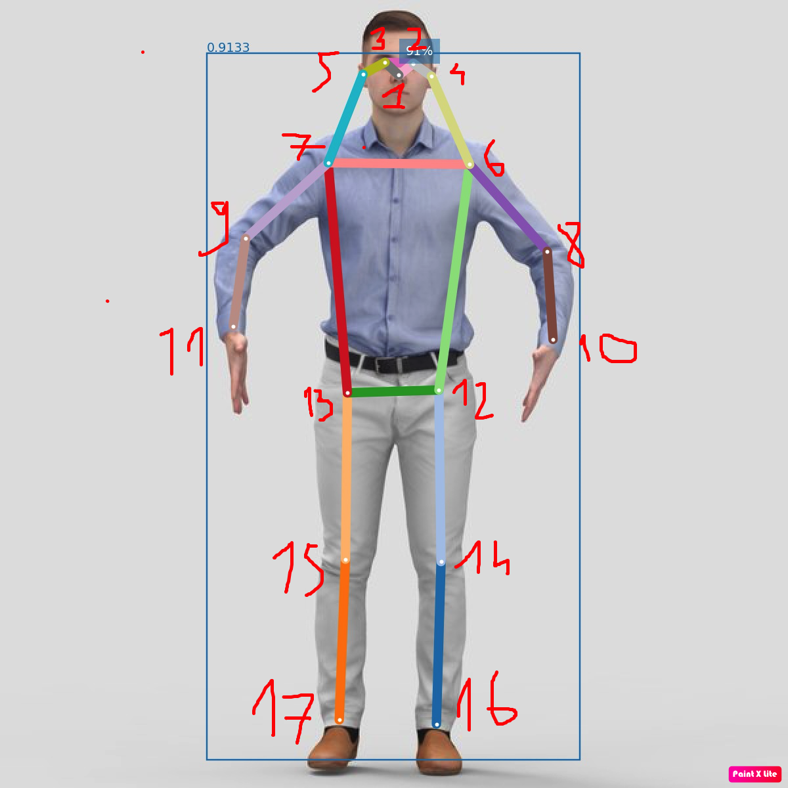

# Human Pose 

Github : https://github.com/openpifpaf/openpifpaf

# Requirements
```
pip3 install openpifpaf matplotlib
```

# Inference 
```
python3 -m openpifpaf.predict <Image_Path> --image-output --json-output --show
```

- Image with keypoints :  ```<Image_Path>.predictions.jpeg```
- 17 keypoints and bounding boxes is in file ```<Image_Path>.predictions.json```
    - Keypoints: 54 floats with format [x_i, y_i, v_i] x 17 or ([x_1, y_1, v1, x_2, y_2, v_2, ...])
    - Bounding boxes:
    - Confidence score:
    - Category_id:


With 1-based index: 


